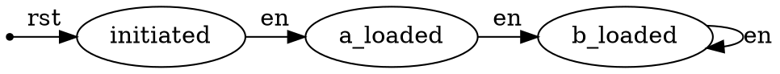

---
puppeteer:
  landscape: true
  format: "A4"
  timeout: 3000 # <= 特殊设置，意味着等待（waitFor） 3000 毫秒
---

# Lab 1. 运算器及其应用

<center>姓名:傅申 学号: PB20000051 实验日期: 2022-3-15</center>

## 实验题目
运算器及其应用
## 实验目的
- 掌握算术逻辑单元 (ALU) 的功能
- 掌握数据通路和控制器的设计方法
- 掌握组合电路和时序电路，以及参数化和结构化的 Verilog 描述方法
- 了解查看电路性能和资源使用情况

## 实验平台
- Xilinx Vivado v2019.1
- Microsoft Visual Studio Code
- FPGAOL
## 实验过程
<!--此处讲述实验过程，最好附上关键模块的代码。-->
### ALU
#### 32 位操作数 ALU
32 位 ALU 的文件结构如下
```plaintext
main (main.v)
└─── alu32: alu (alu.v)
```
ALU 核心模块的代码如下
```verilog {.line-numbers}
module alu #(parameter WIDTH = 32)  // data width
(
    input [WIDTH - 1:0] a, b,       // operands
    input [2:0] f,                  // operation
    output reg [WIDTH - 1:0] y,     // output
    output z                        // zero
);
    assign z = (y == {WIDTH{1'h0}});
    always @(*) begin
        case (f)
            3'b000:
                y = a + b;
            3'b001:
                y = a - b;
            3'b010:
                y = a & b;
            3'b011:
                y = a | b;
            3'b100:
                y = a ^ b;
            default:
                y = {WIDTH{1'h0}};
        endcase
    end
endmodule
```
为了查看时间性能报告, 需要在输入输出端口处加上寄存器. 用另一个 Verilog 文件实例化 ALU 模块, 并命名为 `main`, 模块如下.
```verilog {.line-numbers}
module main(
    input clk,
    input [31:0] a, b,
    input [2:0] f,
    output reg [31:0] y,
    output reg z
);
    // wire mapping
    reg [31:0] alu_a, alu_b;
    reg [2:0] alu_f;
    wire [31:0] alu_y;
    wire alu_z;
    alu #(.WIDTH(32)) alu32(
        .a(alu_a),
        .b(alu_b),
        .f(alu_f),
        .y(alu_y),
        .z(alu_z)
    );

    // registers
    always @(posedge clk) begin
        alu_a <= a;
        alu_b <= b;
        alu_f <= f;
        y <= alu_y;
        z <= alu_z;
    end
endmodule
```
### 6 位操作数 ALU
6 位操作数 ALU 的数据通路如下 (来自 PPT)

6 位 ALU 的设计文件结构如下
```plaintext
main (main.v)
├─── dec: decoder (decoder.v)
└─── alu1: alu (alu.v)
```
其中译码器模块的代码如下
```verilog {.line-numbers}
module decoder(
    input en,
    input [1:0] sel,
    output ea, eb, ef
);
    assign ea = en & (sel == 2'b00);
    assign eb = en & (sel == 2'b01);
    assign ef = en & (sel == 2'b10);
endmodule
```
而 ALU 是通过实例化 32 位 ALU 模块实现的, 顶层模块 `main` 如下
```verilog {.line-numbers}
module main #(parameter WIDTH = 6)
(
    input clk,
    input en,
    input [1:0] sel,
    input [WIDTH - 1:0] x,
    output reg [WIDTH - 1:0] y,
    output reg z
);
    // wire mapping
    wire ef, ea, eb;
    wire alu_z;
    wire [WIDTH - 1:0] alu_y;
    reg [2:0] f;
    reg [WIDTH - 1:0] a, b;
    decoder dec(
        .en(en),
        .sel(sel),
        .ef(ef),
        .ea(ea),
        .eb(eb)
    );
    alu #(.WIDTH(WIDTH)) alu1
    (
        .a(a),
        .b(b),
        .f(f),
        .y(alu_y),
        .z(alu_z)
    );
    // registers
    always @(posedge clk) begin    
        if (ef) f <= x[2:0];
        if (ea) a <= x;
        if (eb) b <= x;
        y <= alu_y;
        z <= alu_z;
    end
endmodule
```
### FLS
FLS 模块的数据通路如下 (MUX 的输入有所不同), 可以看到输出信号 `f` 同时作为 ALU 的一个输入.

FLS 的设计文件结构如下
```plaintext
fls (fls.v)
├─── get_en_edge: get_edge (get_edge.v)
├─── adder: alu (alu.v)
└─── fsm1: fsm (fsm.v)
```
首先, 取信号边缘的模块 `get_edge` 如下
```verilog {.line-numbers}
module get_edge(
    input clk,
    input rst,
    input signal,
    output signal_edge
);
    reg signal_r1, signal_r2;
    always @(posedge clk) signal_r1 <= ~rst & signal;
    always @(posedge clk) signal_r2 <= signal_r1;
    assign signal_edge = signal_r1 & ~signal_r2;
endmodule
```
而状态机有三个状态, 分别为 `initiated`, `a_loaded`, `b_loaded`, 输出为当前状态, 状态转移图如下

对应的 Verilog 模块如下
```verilog {.line-numbers}
module fsm(
    input clk,
    input rst,
    input en,
    output [1:0] state
);
    reg [1:0] curr_state;
    reg [1:0] next_state;
    
    parameter initiated = 2'b00;
    parameter a_loaded = 2'b01;
    parameter b_loaded = 2'b10;

    // FSM Part 1: state transfer
    always @(posedge clk) begin
        if (rst) curr_state <= initiated;
        else if (en) curr_state <= next_state;
    end

    // FSM Part 2: next state
    always @(curr_state) begin
        case (curr_state)
            initiated: next_state = a_loaded;
            a_loaded: next_state = b_loaded;
            b_loaded: next_state = b_loaded;
            default: next_state = initiated;
        endcase
    end

    // FSM Part 3: output logic and state action
    assign state = curr_state;
endmodule
```
通过实例化上面两个模块以及 ALU, 最后 FLS 的 Verilog 模块如下. 其中在 FSM 状态转移时刻 (`en_edge` 为高电平), ALU 输入处的寄存器被激活, 对应的信号被传入 ALU.
```verilog {.line-numbers}
module fls(
    input clk,
    input rst,
    input en,
    input [6:0] d,
    output reg [6:0] f
);
    // Wire mapping
    // get edge
    wire en_edge;
    get_edge get_en_edge(
        .clk(clk),
        .rst(rst),
        .signal(en),
        .signal_edge(en_edge)
    );
    // ALU
    reg [6:0] a;
    wire [6:0] alu_out;
    alu #(.WIDTH(7)) adder(
        .a(a),
        .b(f),
        .f(3'b000),
        .y(alu_out)
    );
    
    // FSM
    wire [1:0] sel;
    fsm fsm1(
        .clk(clk),
        .rst(rst),
        .en(en_edge),
        .state(sel)
    );

    // registers and MUXes
    always @(posedge clk) begin
        if (rst) a <= 7'h00;
        else if (en_edge) begin
            case (sel)
                2'b00: a <= d;
                2'b10: a <= f;
                default: a <= a;
            endcase
        end
    end
    always @(posedge clk) begin
        if (rst) f <= 7'h00;
        else if (en_edge) begin
            case (sel)
                2'b00: f <= d;
                2'b01: f <= d;
                2'b10: f <= alu_out;
                default: f <= f;
            endcase
        end
    end
endmodule
```
## 实验结果
<!--此处讲述实验结果，必须附上最后的仿真波形图或是下载到板子上的实拍结果图（视实验要求而定）。-->
### 32 位 ALU
RTL 电路图如下

综合电路图如下

综合电路资源报告如下

时间性能报告如下

针对下面的仿真文件
```verilog {.line-numbers}
module tb();
    parameter clk_sep = 1;
    parameter sep = 10;
    reg clk;
    reg [31:0] a;
    reg [31:0] b;
    reg [2:0] f;
    wire [31:0] y;
    wire z;
    main test(
        .clk(clk),
        .a(a),
        .b(b),
        .f(f),
        .y(y),
        .z(z)
    );
    initial begin
       clk = 1'b0;
       a = 32'ha5a5a5a5;
       b = 32'h5a5aa5a5;
       f = 3'b000;
    end
    always #(clk_sep) clk = ~clk;
    initial begin
        #(sep) f = 3'b001;
        #(sep) f = 3'b010;
        #(sep) f = 3'b011;
        #(sep) f = 3'b100;
        #(sep) f = 3'b101;
        #(sep) f = 3'b110;
        #(sep) f = 3'b111;
        #(sep) $finish;
    end
endmodule
```
仿真结果如下

### 6 位 ALU
RTL 电路图如下

综合电路图如下

综合电路资源报告如下

时间性能报告如下

针对下面的仿真文件
```verilog {.line-numbers}
module tb();
    parameter timesep = 100;
    parameter timesep_clk = 10;
    parameter width = 6;

    reg clk, en;
    reg [1:0] sel;
    reg [width-1:0] x;

    wire [width-1:0] y;
    wire z;

    main #(.WIDTH(width)) testbench(
        .clk(clk),
        .en(en),
        .sel(sel),
        .x(x),
        .y(y),
        .z(z)
    );
    always #(timesep_clk) clk = ~clk;
    initial begin
        clk = 1'b0;
        en = 1'b0;
        sel = 2'b11;
        x = 6'h00;
        #(timesep)
        en = 1'b1;
        #(timesep)
        sel = 2'b10;
        x = 6'h00;
        #(timesep)
        sel = 2'b00;
        x = 6'h14;
        #(timesep)
        sel = 2'b01;
        x = 6'h08;
        #(timesep)
        sel = 2'b10;
        x = 6'h01;
        #(timesep)
        $finish;
    end
endmodule
```
仿真结果如下


下载测试: 在 FPGAOL 上计算 8 + 16, 输出如下图

### FLS
针对下面的仿真文件
```verilog {.line-numbers}
module tb();
    reg clk;
    reg rst;
    reg en;
    reg [6:0] d;
    wire [6:0] f;

    fls test(
        .clk(clk),
        .rst(rst),
        .en(en),
        .d(d),
        .f(f)
    );

    parameter timesep = 1;

    always #(timesep) clk = ~clk;

    initial begin
        clk = 1'b0;
        #200 $finish;
    end

    initial begin
        rst = 1'b1;
        #7 rst = 1'b0;
    end

    initial begin
        en = 1'b0;
        #2  en = 1'b1;
        #25 en = 1'b0;
        #10 en = 1'b1;
        #10 en = 1'b0;
        #10 en = 1'b1;
        #10 en = 1'b0; 
        #10 en = 1'b1;
        #10 en = 1'b0;
        #10 en = 1'b1;
        #10 en = 1'b0;
        #10 en = 1'b1;
    end

    initial begin
        d = 7'h02;
        #32 d = 7'h03;
        #20 d = 7'h04;
        #20 d = 7'h05;
        #20 d = 7'h06;
    end
endmodule
```
仿真结果如下

在 FPGAOL 上以 1 和 2 分别作为第一, 二个输入, 一系列输出如下


## 心得体会
<!--此处讲述实验的心得体会与改进意见。-->
实验难度适中.